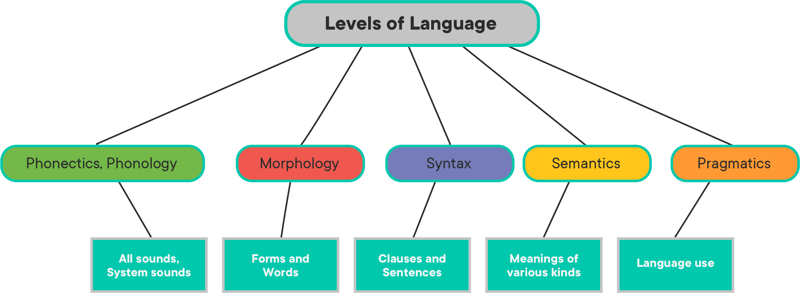
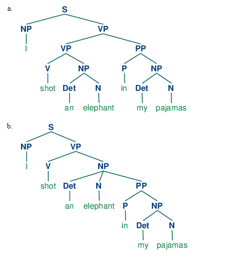

# Context-Free Grammars and POS Tagging

## Introduction

In this lesson, we'll explore the concept of context-free grammars, and the role they play in linguistics and NLP, particularly in relation to part-of-speech tagging.

## Objectives

You will be able to:

- Describe how you might manually create rules related to context-free grammar 
- Define context-free grammars 
- Explain parts of speech (POS) tagging, and why it is important in NLP 

## What is a Context-Free Grammar?

Consider the following sentence: 

> "Colorless green ideas sleep furiously."

This is a sentence dreamed up by the famous linguist [Noam Chomsky](https://en.wikipedia.org/wiki/Noam_Chomsky). This sentence, while correct at the **_grammatical_** or **_syntactic_** level, is just a bunch of nonsense when we consider it at the **_semantic_** level. The sentence follows all the proper rules for a sentence in English, although in reality, it's complete nonsense. This was one of Chomsky's big ideas -- that speech contains an underlying "deep structure" that we recognize, regardless of the actual content of the sentence. We don't need any context about what the sentence is actually about to determine if the grammar is correct -- hence the name, **_Context-Free Grammar_**, which we'll refer to as 'CFG' for short, for the remainder of this lesson. 

In order to understand CFGs, we first need to back up and gain a little background knowledge about linguistics. According to linguistics, there are five different levels of language:

When talking about CFGs, we're focusing on the **_syntactic level_**. This level worries only about the structure of the sentence, not the informational content. 

So why do CFGs matter to us? For starters, they are an important part of computer science as a whole, as any code we write gets fed through a parser to determine what we want the computer to actually do. For NLP specifically, they are important because they describe a way that we can write a grammar to interpret sentences at the syntactic level. This is an approach that can be used when we want to generate **_Part-Of-Speech (POS) Tags_**. Consider the word "run". This word can be interpreted as either a noun or a verb. As a noun, we may be talking about the concept of going for a jog, or a run scored in a baseball game. As a verb, we may be talking about the action of running. On its own, we don't know this. Part of the way we know which meaning to interpret for the word is our understanding of where the word fits into the sentence, and the part of speech it occupies in that sentence -- we implicitly recognize that the sentence "I run in the mornings" uses run as a verb, while the sentence "The Yankees scored a run" uses it as a noun, all based on it's placement in the sentence. 

This brings us to the concept of **_Parse Trees_**. 

## Parse Trees and Sentence Structure

In English, sentences consist of a **_Noun Phrase_** followed by a **_Verb Phrase_**, which may optionally be followed by a **_Prepositional Phrase_**. This seems simple, but it gets more tricky when we realize that there is a recursive structure to these phrases. A noun phrase may consist of multiple smaller noun phrases, and in some cases, even a verb phrase. Similarly, a verb phrase can consist of multiple smaller verb phrases and noun phrases, which can themselves be made up of smaller noun phrases and verb phrases. 

This leads levels of **_ambiguity_** that can be troublesome for computers. NLTK's documentation explains this by examining the classic Groucho Marx joke:

> "While hunting in Africa, I shot an elephant in my pajamas. How he got into my pajamas, I don't know."

There are two different ways that we can interpret the first sentence. The common way that we interpret it is that a person shot an elephant while wearing pajamas. However, the alternative interpretation that is still correct (and the source of Marx's timeless punchline) is that Marx shot an elephant that was actually _in_ his pajamas. While we humans immediately understand the correct interpretation of the sentence (and hopefully get the joke), a computer has no way of knowing which of the two is the correct interpretation. 

The difference between the two interpretations can be most easily understood by comparing the **_Parse Tree_** for each. Take a look at this diagram from the [NLTK Book's chapter on analyzing sentence structure](https://www.nltk.org/book/ch08.html):

Let's break these diagrams down piece by piece. The first, most natural interpretation of the phrase "I shot an elephant in my pajamas" breaks down the sentence as such:

* Noun phrase: `['I']`
* Verb phrase: `['shot', 'an', 'elephant']`
* Prepositional phrase: `['in', 'my', 'pajamas']`

This is the basic sentence structure that we are used to hearing. The noun phrase tells us the subject of the sentence, the verb phrase tells us what the subject did, and the prepositional phrase offers more information about the circumstances of the action, e.g. where, when, how, etc. Note that the verb phrase here is made up of a verb ('shot'), followed by a noun phrase ('an elephant'), much in the same way that the prepositional phrase consists of a preposition ('in'), followed by a noun phrase ('my pajamas'). This nested structure is **_recursive_**.

However, the ambiguity that Marx plays off of uses the second parse tree's structure:

* Noun phrase: `['I']`
* Verb phrase: `['shot', 'an', 'elephant', 'in', 'my', 'pajamas']`

If we compare the two parse trees visually, the difference becomes clear. Whereas in the first interpretation, the verb phrase consists of a verb phrase and a prepositional phrase, the second interpretation is different, treating the prepositional phrase as part of a noun phrase, which is, in turn, part of the noun phrase contained within that verb phrase. If all the grammar terms are making your head spin a little, don't worry, that's normal! The simple explanation here is that the first interpretation treats 'elephant' and 'in my pajamas' as belonging to different things, while the second treats 'elephant in my pajamas' as a single phrase. 

## Why Does This Matter?

You may be wondering why any of this actually matters to a Data Scientist. At a glance, it mostly just seems like a rehashing of a bunch of grade-school grammar rules. The answer is that using parse trees to understand sentence structure can help us determine meaning when working with human speech. It also helps highlight why this is such a complicated task -- computers do not have the ability to judge the meaning of a sentence based on things like semantic context like we do. Put simply, we know what an elephant is, what pajamas are, and understand that it's highly unlikely that an elephant could fit in pajamas. This helps us determine how we understand that sentence on the fly -- computers don't have this luxury, so they don't know which to choose!

## POS Tagging and CFGs

This brings us to part of speech tagging. One way that we can help a computer understand how to interpret a sentence is to create a CFG for it to use when parsing. The CFG defines the rules of how sentences can exist. We do this by labeling different word tokens as their grammatical types, and then defining which combinations of grammatical types are valid examples of verb phrases, noun phrases, etc. 

Let's take a look at the example CFG from the NLTK link provided above:

Let's break down this CFG, and see if we can understand it a bit better. 

* `S -> NP VP` A sentence (S) consists of a Noun Phrase (NP) followed by a Verb Phrase (VP).
* `PP -> P NP` A Prepositional Phrase (PP) consists of a Preposition (P) followed by a Noun Phrase (NP)
* `NP -> Det N | Det N PP | 'I'` A Noun Phrase (NP) can consist of:
    * a Determiner (Det) followed by a Noun (N), or (as denoted by `|`) 
    * a Determiner (Det) followed by a Noun (N), followed by a Prepositional Phrase (PP), or
    * The token `'I'`.
* `VP -> V NP | VP PP` A Verb Phrase can consist of:
    * a Verb (V) followed by a Noun Phrase (NP) or
    * a Verb Phrase (VP) followed by a Prepositional Phrase (PP)
* `Det -> 'an' | 'my'` Determiners are the tokens 'an' or 'my'
* `N -> 'elephant' | 'pajamas'` Nouns are the tokens 'elephant' or 'pajamas'
* `V -> 'shot'` Verbs are the token 'shot'
* `P -> 'in'` Prepositions are the token 'in'

As we can see, the CFG provides explicit rules as to both:
1. How sentences, noun phrases, verb phrases, and prepositional phrases may be structured
2. What parts of speech each token belongs to 

This defines a very small CFG that allows the parser to successfully generate parse trees for the Groucho Marx's sentence. Note that both the parse trees seen above are valid, according to the rules defined in this grammar. Even though this grammar is quite explicit, both of them work. 

So what happens if this CFG runs across a sentence structure it doesn't understand, or a token that it doesn't have a POS label for? It fails! True CFGs are quite complex. This was a toy example. 

In the next lab, we'll gain some practice writing some toy CFGs for a few target sentences. We'll also learn how we can skip all this fun stuff and get existing POS tags for our tokens straight from NLTK whenever we need them, thanks to databases such as the **_Penn Tree Bank_**!

## Summary

In this lesson, we dove into linguistics to understand the concept of a **_Context-Free Grammar_**, and explored how they can be used to create parse trees for sentences.

